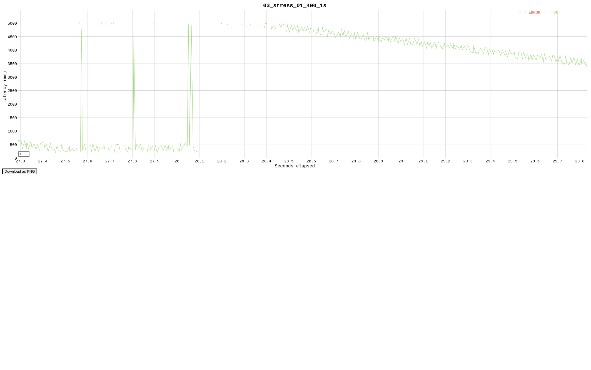

# Отчёт "Комплексное исследование производительности чёрного ящика"

Данный бираник - golang HTTP-сервер

```text
Displaying notes found in: .note.go.buildid
  Owner                Data size        Description
  Go                   0x00000053       GO BUILDID
```

## 1. Окружение

### ОС

- **ОС:** linux
- **Дистрибутив:** Debian

### Аппаратные ресурсы

- **Кол-во ядер CPU:** 12
- **RAM:** 32 gb

---

## 2. Методика и инструменты тестирования

### Сценарий прогона (как тестировалось)

- Приложение `app_linux_amd64` запускалось без аргументов и работало параллельно с подачей HTTP‑нагрузки генератором vegeta.
- Во время прогона непрерывно собирались системные метрики (очереди выполнения, CPU, память, I/O и т.д) в отдельные лог‑файлы.
- В качестве цели теста рассматривалось поведение приложения под ступенчатой и стрессовой нагрузкой, а также под длительной нагрузкой уровня умеренного уровня.

### Нагрузочный профиль vegeta (targets/rate в целом)

- Нагрузка задавалась в виде фаз с фиксированным rate (rps) и известными временными интервалами.
- Конкретные targets/endpoint’ы vegeta задаются в отдельном файле `targets.txt`

```text

GET http://localhost:8080/
User-Agent: vegeta-test
X-Test-Header1: value1
X-Test-Header2: value2

POST http://localhost:8080/
Content-Type: application/json
User-Agent: vegeta-test
X-Test-Header1: value1
X-Test-Header2: value2
@post_body.json
```

---

### Таймлайн нагрузки

Фазы и интенсивность нагрузки vegeta по времени:

| Фаза          | Интервал (MSK)       | Интенсивность |
| ------------- |----------------------|---------------|
| Холодный старт     | 19:04:55–19:06:25    | 0 rps         |
| Прогрев на малом RPS     | 19:06:25–19:08:27    | 20/1s         |
| Шаг 1    | 19:08:27–19:10:01    | 50/1s         |
| Шаг 2    | 19:10:01–19:11:38    | 100/1s        |
| Шаг 3    | 19:11:38–19:13:18    | 150/1s        |
| Шаг 4    | 19:13:18–19:15:02    | 200/1s        |
| "Стресс"-тест на бОльшем RPS  | 19:15:02–19:15:45    | 400/1s        |
| Умеренная нагрузка, стабилизация      | 19:15:45–19:21:19    | 150/1s        |
| Тест сотсояния покоя после отключения нагрузки | 19:21:19–19:25:13    | 0 rps         |

---

## Утилиты мониторинга

- sar  
- mpstat  
- pidstat  
- vmstat  
- iostat  

## Уровень 1

### 1. Утилизация CPU

- В ходе тестирования нагрузка распределялась по ядрам равномерно

```text
07:04:54 PM  CPU    %usr   %nice    %sys %iowait    %irq   %soft  %steal  %guest  %gnice   %idle
07:04:55 PM  all   25.36    0.00   11.70    2.97    0.00    0.00    0.00    0.00    0.00   59.97

...

07:14:34 PM  CPU    %usr   %nice    %sys %iowait    %irq   %soft  %steal  %guest  %gnice   %idle
07:14:35 PM  all   16.53    0.00    4.32    1.00    0.00    0.25    0.00    0.00    0.00   77.91

...

07:21:13 PM  CPU    %usr   %nice    %sys %iowait    %irq   %soft  %steal  %guest  %gnice   %idle
07:21:14 PM  all   13.08    0.00   20.51   48.72    0.00    0.00    0.00    0.00    0.00   17.69

...

07:27:18 PM  CPU    %usr   %nice    %sys %iowait    %irq   %soft  %steal  %guest  %gnice   %idle
07:27:19 PM  all    0.92    0.00   27.53   68.45    0.00    0.00    0.00    0.00    0.00    3.10
```

- Виден постепенный рост `system time` и `iowait` по ходу тестирования. Показатели не пришли в норму и на этапе покоя, при повторном тестирования с меньшей суммарной продолжительностью удалось добиться спада показателей и частичной стабилизации

- Также наблюдается положительная динамика блокировок
- Длина очереди выполнения превышает допустимые значения (достигает значений вплоть до `~150`) после подачи "стресс"-нагрузки

```text
07:04:55 PM   runq-sz  plist-sz   ldavg-1   ldavg-5  ldavg-15   blocked
07:04:56 PM         8      1145      3.77      1.10      0.38         1

...

07:17:06 PM         6      1250     11.68      5.56      2.67        18

...

07:18:04 PM       147      1354     93.12     28.48     10.62        27

...

07:27:37 PM        12      1900    216.92    146.99     78.76       308

07:27:58 PM         2      1928    191.85    145.73     79.80       115
```

### 2. Активность потоков

- В ходе подачи нагрузки растет количество потоков ОС, поскольку данный бинарник - go-приложение, предполагается создание доп. числа ОС-потоков планировщиком языка в случае необходимости, долгих системных вызовов.
- О наличии логики исполнения "тяжелых" системных вызовов косвенно может сказать показатель числа потков в состоянии `D` (uninterruptible sleep), что также коррелирует с возрастающим system time/iowait

```text
ts=2025-12-14T19:04:55+03:00 total=5 R=0 S=5 D=0 other=0
...
ts=2025-12-14T19:13:50+03:00 total=14 R=0 S=6 D=8 other=0
...
ts=2025-12-14T19:16:24+03:00 total=67 R=0 S=19 D=48 other=0
...
ts=2025-12-14T19:22:42+03:00 total=67 R=0 S=66 D=1 other=0

```

- Также можно наблюдать частое переключение контекста планировщиком, скорее всего, из-за того, что потоки находятся в ожидании ресурса

```text
07:04:54 PM   UID      TGID       TID   cswch/s nvcswch/s  Command
07:04:55 PM 174209043      7559         -    206.00      0.00  app_linux_amd64
...
07:05:03 PM 174209043         -      7581    142.00      0.00  |__app_linux_amd64
07:17:17 PM 174209043         -     11486    238.24     47.06  |__app_linux_amd64
...
07:22:43 PM 174209043         -      7581    372.28      0.00  |__app_linux_amd64
...
07:27:26 PM 174209043         -      7581    204.90      0.00  |__app_linux_amd64
```

### 3. Общие системные метрики

- Прослеживаются давление на ОЗУ, активный свопинг, даже в фазе "покоя"

```text
### ts=2025-12-14T19:04:55+03:00
               total        used        free      shared  buff/cache   available
Mem:            30Gi       4.8Gi        23Gi        28Mi       3.0Gi        25Gi
Swap:          979Mi          0B       979Mi

...
### ts=2025-12-14T19:13:06+03:00
               total        used        free      shared  buff/cache   available
Mem:            30Gi        15Gi        11Gi        24Mi       4.0Gi        14Gi
Swap:          979Mi          0B       979Mi

...

### ts=2025-12-14T19:21:21+03:00
               total        used        free      shared  buff/cache   available
Mem:            30Gi        30Gi       342Mi        11Mi       323Mi       264Mi
Swap:          979Mi       975Mi       4.1Mi
```

- Также возрастает утилизация диска, сохраняется вплоть до конца измерений

```text

Device            r/s     rkB/s   rrqm/s  %rrqm r_await rareq-sz     w/s     wkB/s   wrqm/s  %wrqm w_await wareq-sz     d/s     dkB/s   drqm/s  %drqm d_await dareq-sz     f/s f_await  aqu-sz  %util
dm-0          1787.22  40242.93     0.00   0.00    0.38    22.52  259.34   2856.42     0.00   0.00    3.65    11.01    0.00      0.00     0.00   0.00    0.00     0.00    0.00    0.00    1.62  24.53
dm-1          1785.21  40200.30     0.00   0.00    0.38    22.52  258.36   2856.42     0.00   0.00    3.56    11.06    0.00      0.00     0.00   0.00    0.00     0.00    0.00    0.00    1.59  24.59
dm-2             1.42     30.10     0.00   0.00    0.44    21.26    0.00      0.00     0.00   0.00    0.00     0.00    0.00      0.00     0.00   0.00    0.00     0.00    0.00    0.00    0.00   0.02
nvme0n1       1283.82  41072.22   533.03  29.34    0.27    31.99  181.48   2856.67    82.75  31.32    2.05    15.74    0.00      0.00     0.00   0.00    0.00     0.00   38.10    2.02    0.80  19.28
...


Device            r/s     rkB/s   rrqm/s  %rrqm r_await rareq-sz     w/s     wkB/s   wrqm/s  %wrqm w_await wareq-sz     d/s     dkB/s   drqm/s  %drqm d_await dareq-sz     f/s f_await  aqu-sz  %util
dm-0             0.00      0.00     0.00   0.00    0.00     0.00  603.00   2588.00     0.00   0.00    0.46     4.29    0.00      0.00     0.00   0.00    0.00     0.00    0.00    0.00    0.28  26.00
dm-1             0.00      0.00     0.00   0.00    0.00     0.00  603.00   2588.00     0.00   0.00    0.46     4.29    0.00      0.00     0.00   0.00    0.00     0.00    0.00    0.00    0.28  26.00
nvme0n1          0.00      0.00     0.00   0.00    0.00     0.00  544.00   2588.00    59.00   9.78    0.55     4.76    0.00      0.00     0.00   0.00    0.00     0.00   75.00    2.31    0.47  24.80

...

Device            r/s     rkB/s   rrqm/s  %rrqm r_await rareq-sz     w/s     wkB/s   wrqm/s  %wrqm w_await wareq-sz     d/s     dkB/s   drqm/s  %drqm d_await dareq-sz     f/s f_await  aqu-sz  %util
dm-0           747.00  35372.00     0.00   0.00    0.66    47.35 16577.00  88792.00     0.00   0.00   10.74     5.36    0.00      0.00     0.00   0.00    0.00     0.00    0.00    0.00  178.57  44.40
dm-1           699.00  35180.00     0.00   0.00    0.64    50.33  854.00   3460.00     0.00   0.00    0.91     4.05    0.00      0.00     0.00   0.00    0.00     0.00    0.00    0.00    1.22  42.40
dm-2            48.00    192.00     0.00   0.00    0.92     4.00 15712.00  85332.00     0.00   0.00   11.28     5.43    0.00      0.00     0.00   0.00    0.00     0.00    0.00    0.00  177.21  17.60
nvme0n1        728.00  35500.00    20.00   2.67    0.60    48.76 6046.00  88796.00 10598.00  63.67    2.10    14.69    0.00      0.00     0.00   0.00    0.00     0.00  115.00    1.15   13.29  36.00

...

Device            r/s     rkB/s   rrqm/s  %rrqm r_await rareq-sz     w/s     wkB/s   wrqm/s  %wrqm w_await wareq-sz     d/s     dkB/s   drqm/s  %drqm d_await dareq-sz     f/s f_await  aqu-sz  %util
dm-0          28961.39 1741029.70     0.00   0.00    2.07    60.12   33.66    142.57     0.00   0.00    2.12     4.24    0.00      0.00     0.00   0.00    0.00     0.00    0.00    0.00   60.11  98.61
dm-1          28929.70 1740732.67     0.00   0.00    2.08    60.17   24.75    106.93     0.00   0.00    2.56     4.32    0.00      0.00     0.00   0.00    0.00     0.00    0.00    0.00   60.19  98.61
dm-2            20.79     83.17     0.00   0.00    0.57     4.00    8.91     35.64     0.00   0.00    0.89     4.00    0.00      0.00     0.00   0.00    0.00     0.00    0.00    0.00    0.02   1.98
nvme0n1       28850.50 1739861.39    71.29   0.25    1.03    60.31   33.66    142.57     0.00   0.00    0.18     4.24    0.00      0.00     0.00   0.00    0.00     0.00    0.00    0.00   29.58  66.14

...
Device            r/s     rkB/s   rrqm/s  %rrqm r_await rareq-sz     w/s     wkB/s   wrqm/s  %wrqm w_await wareq-sz     d/s     dkB/s   drqm/s  %drqm d_await dareq-sz     f/s f_await  aqu-sz  %util
dm-0          23507.00 1067304.00     0.00   0.00    5.24    45.40  540.00   2156.00     0.00   0.00   20.81     3.99    0.00      0.00     0.00   0.00    0.00     0.00    0.00    0.00  134.52  99.60
dm-1          23425.00 1066916.00     0.00   0.00    5.25    45.55   39.00    152.00     0.00   0.00    4.10     3.90    0.00      0.00     0.00   0.00    0.00     0.00    0.00    0.00  123.22  99.60
dm-2            84.00    336.00     0.00   0.00    3.05     4.00  501.00   2004.00     0.00   0.00   22.11     4.00    0.00      0.00     0.00   0.00    0.00     0.00    0.00    0.00   11.33  23.60
nvme0n1       23125.00 1072100.00   528.00   2.23    5.22    46.36  513.00   2156.00    26.00   4.82   11.12     4.20    0.00      0.00     0.00   0.00    0.00     0.00    5.00    4.00  126.36  72.40

```

- Скачки показателей нагрузки на ОЗУ, диск наблюдается в основном после "стресс"-фазы, в период стабильной постоянной нагрузки, этот момент можно принять за точку старта деградации приложения, о чем дополнительно свидетельствуют графики результатов запросов vegeta

**Stress phase**


**Soak phase**
.png)

---

## Сводная таблица: лог‑файл → метрики

| Лог-файл                 | Какие метрики отражены                                                                 |
|--------------------------|----------------------------------------------------------------------------------------|
| `sar_q.log`              | Очередь выполнения и планирование: `runq-sz`, `plist-sz`, `ldavg-1/5/15`, `blocked`.  |
| `sar_blockio.log`        | Блочный I/O (агрегировано): `tps`, `rtps`, `wtps`, `breads`, `bwrtn`.                 |
| `mpstat.log`             | Per‑CPU утилизация: нагрузка по ядрам (`%usr`, `%sys`, `%iowait`, `%idle`).          |
| `pidstat_cpu_threads.log`| CPU по процессу и потокам: загрузка CPU каждым потоком процесса.                      |
| `pidstat_ctx_threads.log`| Context switches по потокам: `cswch/s`, `nvcswch/s`.                                  |
| `pidstat_io_proc.log`    | I/O на уровне процесса: чтение/запись в единицу времени.                              |
| `vmstat.log`             | Общесистемно: `r/b`, память, swap (`si/so`), I/O (`bi/bo`), interrupts/context switches. |
| `iostat_xz.log`          | Диски/устройства: throughput, `await`, `avgqu-sz`, `%util`.                           |
| `threads_dump.log`       | Снимки потоков процесса: TID, `STAT`, `PSR`, `%CPU`, `%MEM`, имя потока.             |
| `threads_summary.log`    | Агрегированная сводка по потокам (топ по CPU/ctx, статусы).                          |
| `snapshots_mem.log`      | Снимки состояния памяти (free/available/cache или аналогичные значения).             |
| `timeline.txt`           | Описание фаз и таймлайна теста (этапы нагрузки, времена начала/окончания).           |
| `vegeta_compressed.sh` | Скрипты запуска vegeta: targets, rate, duration, параметры нагрузки.           |
